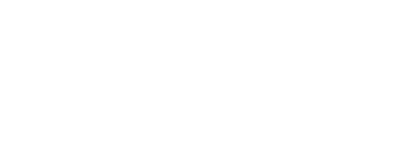

## DFA 

```
A Determinstic Finite Automata can only be at a single state at once, at which an automaton can transition from one state to the other given a defined input. 
```


A DFA consists of 

- A finite set of states, denoted Q.
- A finite set of input symbols, denoted $\Sigma$.
- A transition function that takes states and input symbol as arguments, and return a state, denoted $\delta$.
- A start state, one of the states in Q. 
- A set of final or accepting states F, F is a subset of Q.

	$$ \Huge
	 A = (Q,\Sigma, \delta, q_0, F)
	 $$
	
# DFA graph A



$$ \Huge 
	A = (\{S_0,S_1,S_2,S_3\},\{a,b\},\delta, S_0,\{S_3\})

$$
