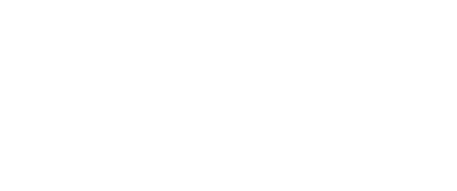
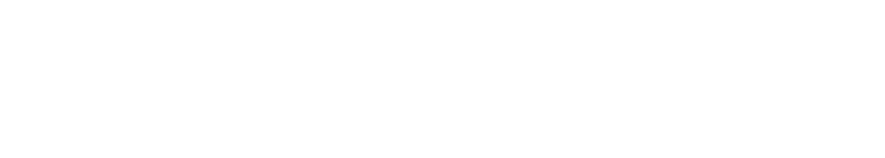

## Regular expression 


```
A regular expression is sequence of characters the specifies a match pattern, can be used to describe or define the same langauge of various automota, such as DFA and epsilon-nfa 
```


#### Induction 
There are four parts to the inductive steps:
	1. If E and F are regular expressions, then E + F is a regular expression, denoting the union of L(E) and L(F). L(E + F) = L(E) + L(F).
	2.  If E and F are regular expressions, then EF is a regular expression denoting the concatenation of L(E) and L(F). That is, L(EF) = L(E) L(F).
	3. If E is a regular expression, then $E^*$ is a regular expression denoting the closure of E. 
	4. If E is a regular expression, then (E) is a regular expression, denoting the same language as E. L((E)) = l(E).


##  [[RL1 - Deterministic Finite Automata (DFA)]] to Regex conversion


#### State elimination process : 

1. For each accepting state q, apply a reduction to produce an equivalent automation with regular expression labels on the arcs. (Eliminate all states except q and start state $q_0$)
2. Identify all transitions leading into and out of the state.
3. For every pair of transition i leading into the state and j leading out, create a new transition between the originating state of i and the destination of j.
4. Remove the eliminated state and all its associated transitions.
5. Repeat until only start and final state remains. 


## Conversion from Regular Expression to $\epsilon$-NFA


> **Theorem 3.6**  
> <div style="font-size:20px; border:1px solid; padding:10px; margin-top:5px;">
 Every language defined by a regular expression is also defined by a finite automaton.
 </div>


###### Suppose L = L(R), we show that L = L(E) for some $\epsilon$-NFA with:
	1. Exactly one accepting state.
	2. No arcs into the initial state.
	3. No arcs out of the accepting state.


construct every state transition separately


#### Example:

Convert the following RegEx to an $\epsilon-NFA$ 

	$\Huge10^*$ 

construct the first part 1 


And then construct $0^*$ 




Then concatenate them 




